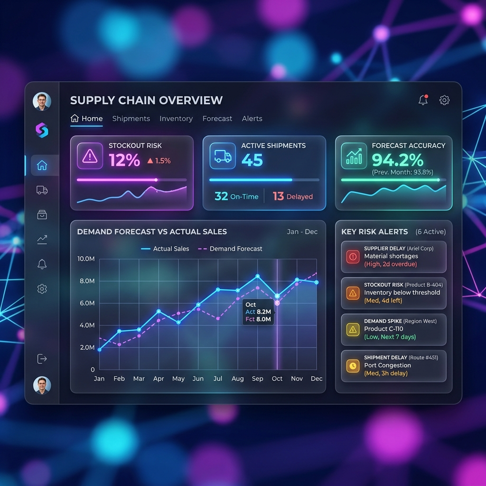
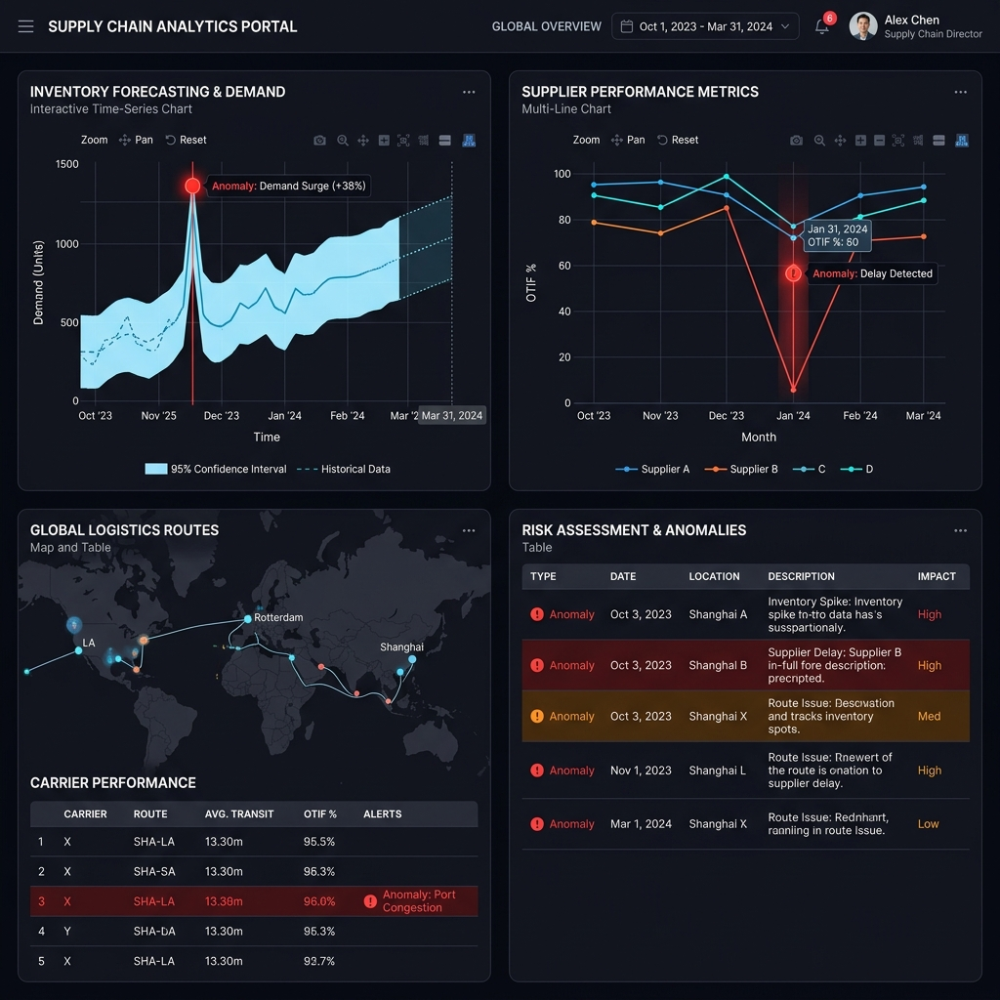
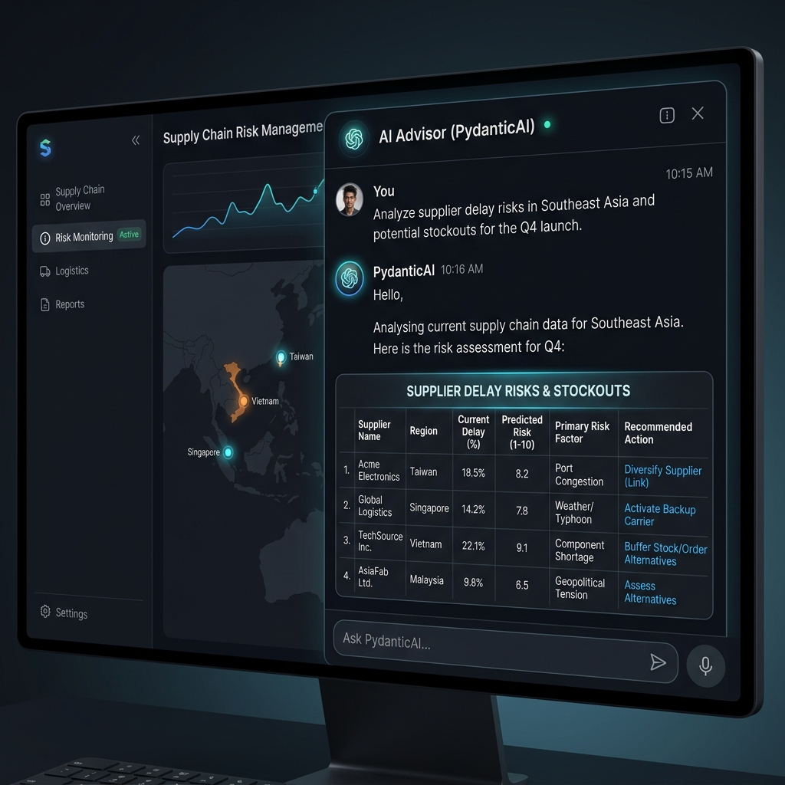
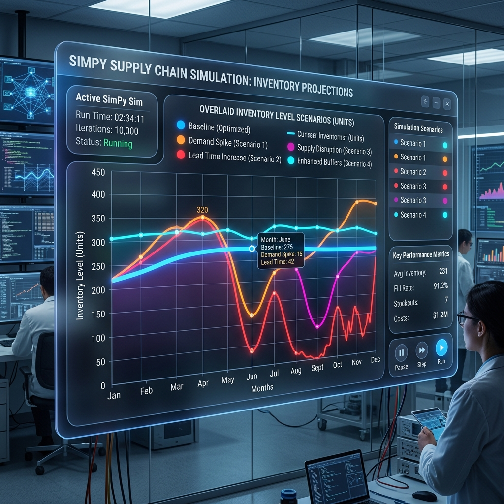

# 🏭 AI Supply Chain Control Tower

[](https://www.python.org/)
[](https://fastapi.tiangolo.com/)
[](https://streamlit.io/)
[](https://www.docker.com/)
[](https://docs.celeryq.dev/)
[](https://opensource.org/licenses/MIT)

An enterprise-grade, multi-tenant AI Supply Chain Control Tower designed to predict stockouts, rank supplier risks, and run supply chain resilience simulations. Powered by a robust FastAPI backend, an interactive glassmorphic Streamlit dashboard, and advanced ML pipelines (XGBoost, Prophet, PyOD, and SHAP explainability) with Celery task queuing and Redis caching.

---

## 📸 Screenshots

````carousel

<!-- slide -->

<!-- slide -->

<!-- slide -->

````

---

## 🚀 Quick Start (Demo Mode)

Launch the entire platform, including data generation, model inference, database schema setup, backend API server, and Streamlit frontend dashboard in **just 3 commands**.

```bash
# 1. Clone the repository
git clone https://github.com/myfault-rohan/AI-Supply-Chain-Control-Tower.git
cd AI-Supply-Chain-Control-Tower

# 2. Install core dependencies
pip install -r requirements-core.txt

# 3. Start the demo launcher
python scripts/start_demo.py
```
*The dashboard will automatically open at **http://localhost:8501**, and the FastAPI interactive Swagger docs will be available at **http://localhost:8000/docs**.*

---

## 🧠 System Architecture

```mermaid
flowchart TD
    A[Data Generator / CSV Ingestion] --> B[Polars Processing Engine]
    B --> C[Feature Engineering Pipeline]
    C --> D[XGBoost Forecaster]
    C --> E[Prophet Forecaster]
    C --> F[LSTM NeuralForecast]
    C --> G[PyOD Anomaly Detector]
    D & E & F & G --> H[Processed Dataset (SQLite / Parquet)]
    H --> I[FastAPI Backend Server]
    I --> J[Streamlit Dashboard Interface]
    I --> K[PDF Report Generator]
    I --> L[Celery Task Queue]
    L --> M[Redis Broker / Backend Cache]
    J --> N[AI Advisor Panel - RAG + PydanticAI]
    N --> O[LlamaIndex + ChromaDB Vector Store]
```

---

## 📊 Machine Learning & Explainable AI

This platform implements a diverse model zoo to cover different aspects of supply chain forecasting, anomaly detection, and risk scoring.

| Model / Pipeline | Library / Framework | Goal | Performance / Details |
| :--- | :--- | :--- | :--- |
| **XGBoost Regressor** | `xgboost` | Predicts daily sales using 15 engineered features | Time-series cross-validation (MAE ≈ 12.4, R² ≈ 0.88) |
| **Prophet (Meta)** | `prophet` | Captures weekly & monthly sales seasonality | Integrated to handle long-term structural trends |
| **LSTM (NeuralForecast)** | `neuralforecast` | Recurrent deep sequence forecasting | Handles complex non-linear sequence prediction (Optional) |
| **Supplier Risk Engine** | `xgboost` + `optuna` | Ranks supplier risk tier based on reliability and delay rates | Hyperparameters optimized automatically via Optuna trials |
| **Anomaly Detector** | `pyod` (ECOD) | Flags anomalous inventory fluctuations & delay spikes | Unsupervised empirical cumulative distribution algorithm |
| **Explainable AI (XAI)** | `shap` | Explains XGBoost predictions to business managers | Generates global feature beeswarms and single-prediction waterfalls |

---

## 🏗️ Technical Stack

* **Data Processing**: `Polars` (leveraging multithreaded columnar processing for ultra-fast preprocessing), `Pandas`, `PyArrow`
* **API Backend**: `FastAPI` (asynchronous, rate-limited via `SlowAPI`, multi-tenant support)
* **Interactive UI**: `Streamlit` (gorgeous glassmorphism styling, Plotly charts, multi-page layout)
* **Task Queue & Caching**: `Celery` task runner, `Redis` message broker, and `fastapi-cache2` Redis caching
* **Simulation Engine**: `SimPy` (discrete event simulator modeling lead-time delays and stockout cascades)
* **AI & RAG Panel**: `PydanticAI` structured outputs, `LlamaIndex` RAG pipelines, and `ChromaDB` vector embeddings
* **Databases**: `SQLAlchemy 2.0` (ORM), `Alembic` (migrations), `SQLite` (default dev) / `PostgreSQL` (production ready)
* **Testing & Quality**: `Pytest` (async support), `Ruff` (linter/formatter), `Mypy` (static typing)

---

## 📁 Project Structure

```text
AI-Supply-Chain-Control-Tower/
├── alembic/                # Database migrations & schemas
├── backend/                # FastAPI Application
│   ├── api_server.py       # Main API Entrypoint & endpoints
│   ├── models.py           # SQLAlchemy database tables
│   ├── auth.py             # JWT Token authentication & multi-tenant filters
│   ├── database.py         # DB session engine
│   └── celery_worker.py    # Celery tasks (model training, PDF generation)
├── dashboard/              # Streamlit Frontend UI
│   ├── dashboard_app.py    # Multi-page main dashboard router
│   ├── pages/              # Dashboard views (Overview, Analytics, Risk Map, Sim Lab, AI Advisor)
│   ├── i18n.py             # Internationalization manager (En/Es)
│   └── utils.py            # Streamlit dashboard layout & helper utilities
├── ml_models/              # Machine Learning Training Pipelines
│   ├── demand_forecaster.py # XGBoost model training & SHAP generation
│   ├── prophet_forecaster.py# Prophet seasonality model
│   ├── supplier_risk_model.py# Supplier Optuna-tuned classifier
│   └── anomaly_detector.py # PyOD ECOD anomaly detection
├── notebooks/              # Jupyter EDA & Model Explainability
│   ├── 01_supplier_eda.ipynb # Polars EDA of supplier delay metrics
│   ├── 04_demand_forecasting.ipynb # Feature engineering & XGBoost forecasting
│   └── 07_shap_explainability.ipynb # Interactive SHAP explainers (beeswarm, waterfall)
├── scripts/                # Database and simulation helpers
│   ├── start_demo.py       # One-command developer demo script
│   └── generate_synthetic_data.py # Synthetic Faker dataset generator
├── sql/                    # Analytical SQL queries for business review
├── tests/                  # Pytest unit and integration test suite
├── Makefile                # Developer build tool
└── requirements-core.txt   # Lightweight production dependencies (excluding Torch)
```

---

## 📓 Jupyter Notebooks

Review the following notebooks in the `notebooks/` folder for in-depth explanations of data science processes:
1. **[01_supplier_eda.ipynb](notebooks/01_supplier_eda.ipynb)**: Implements high-performance Polars operations to rank supplier reliability and identify critical bottleneck tiers.
2. **[04_demand_forecasting.ipynb](notebooks/04_demand_forecasting.ipynb)**: Engineers 15 lag and rolling window features to train, tune, and evaluate XGBoost models against actual sales.
3. **[07_shap_explainability.ipynb](notebooks/07_shap_explainability.ipynb)**: Explains model outputs using SHAP beeswarms and waterfall plots, translating mathematical feature values into plain English business insights.

---

## 🔧 Production Installation & Advanced Setup

For full production execution featuring persistent storage, caching, and task worker queues, follow these steps:

### 1. Configure the Environment
Copy the environment template and update it with your credentials:
```bash
cp .env.example .env
```
Ensure you generate a secure JWT secret:
```bash
openssl rand -hex 32
```

### 2. Startup Infrastructure (via Docker)
Start the PostgreSQL database and Redis server:
```bash
docker-compose up -d database redis
```

### 3. Run Database Migrations
Initialize the tables via Alembic:
```bash
alembic upgrade head
```

### 4. Start Backend Services
Start the Celery asynchronous worker task:
```bash
celery -A backend.celery_worker.celery_app worker --loglevel=info
```
Start the FastAPI HTTP application:
```bash
uvicorn backend.api_server:app --host 0.0.0.0 --port 8000 --reload
```

### 5. Launch the Dashboard
Run the Streamlit frontend application:
```bash
streamlit run dashboard/dashboard_app.py
```

---

## 🧪 Running Tests

Ensure system stability by running the asynchronous pytest suite:
```bash
# Run all tests using Makefile
make test

# Or run pytest manually
pytest tests/ -v --tb=short
```

---

## 🛡️ License

This project is licensed under the MIT License - see the [LICENSE](LICENSE) file for details.
