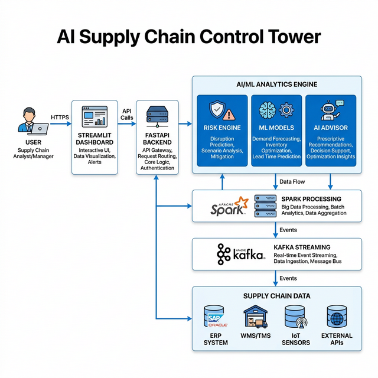

# System Architecture

The AI Supply Chain Control Tower follows a modern, real-time data processing architecture.

## Component Breakdown

1.  **Supply Chain Data**: The source of truth, consisting of inventory, sales, shipments, and supplier data.
2.  **Kafka Streaming**: Ingests real-time events and ensures high-throughput data delivery.
3.  **Spark Processing**: Handles structured streaming, feature engineering, and real-time analytics.
4.  **Machine Learning Models**: Predicts demand spikes and optimizes reorder quantities.
5.  **FastAPI Backend**: Serves as the central intelligence hub, exposing risk analytics and AI insights via a RESTful API.
6.  **Streamlit Dashboard**: A real-time, interactive frontend for supply chain managers.
7.  **AI Advisor**: An LLM-powered assistant for natural language supply chain querying.
